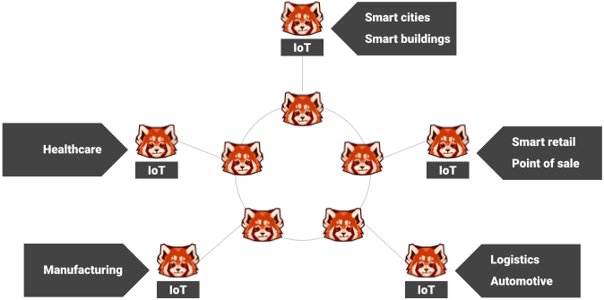

# Redpanda Edge Agent

A lightweight Internet of Things (IoT) agent that runs alongside Redpanda at the edge to forward events to a central Kafka API compatible cluster. The agent is written in Go and uses the [franz-go](https://github.com/twmb/franz-go) Kafka client library.

